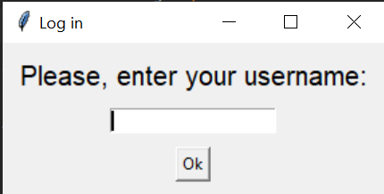
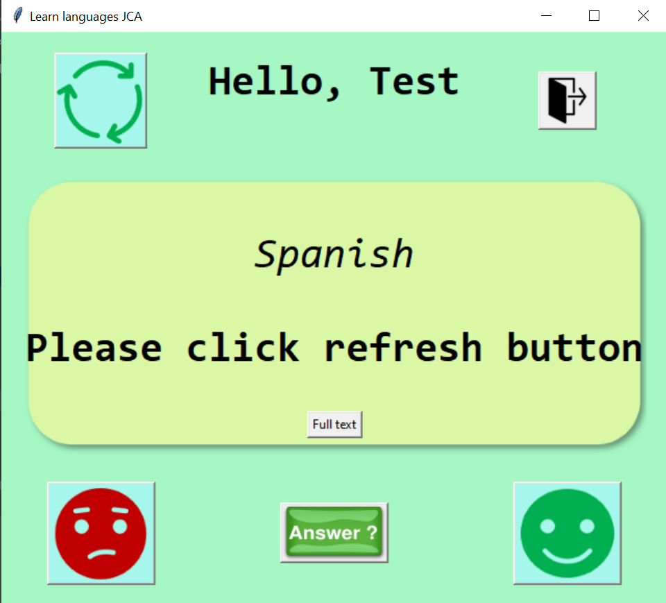
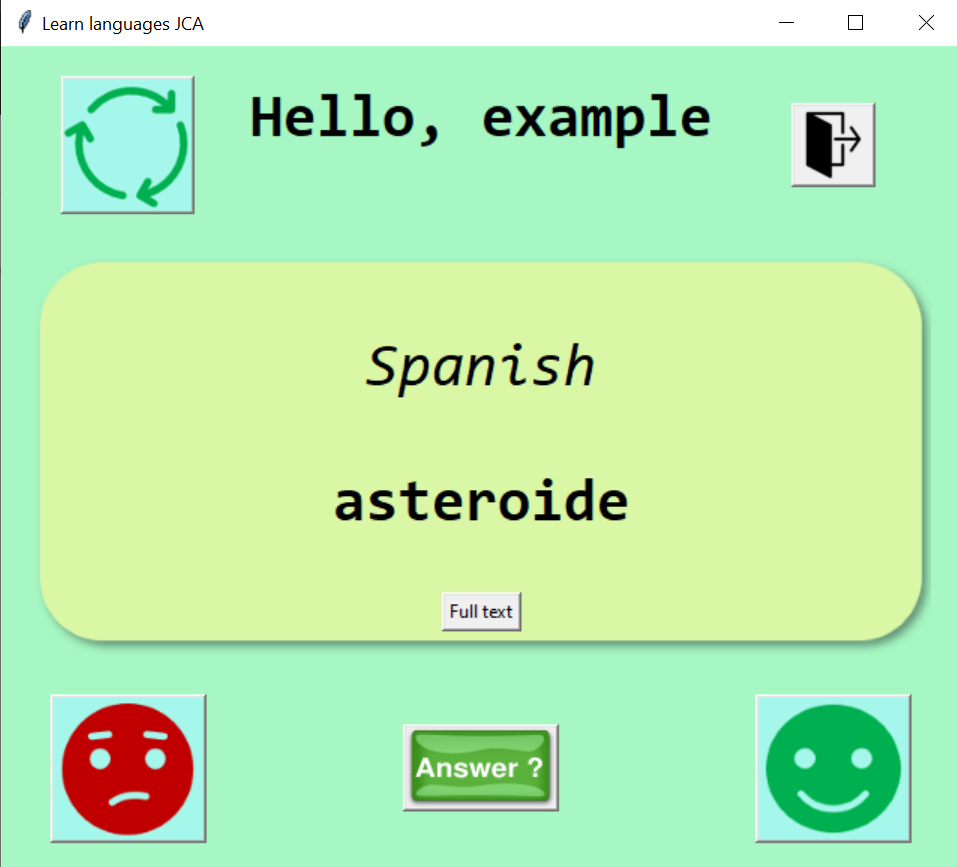
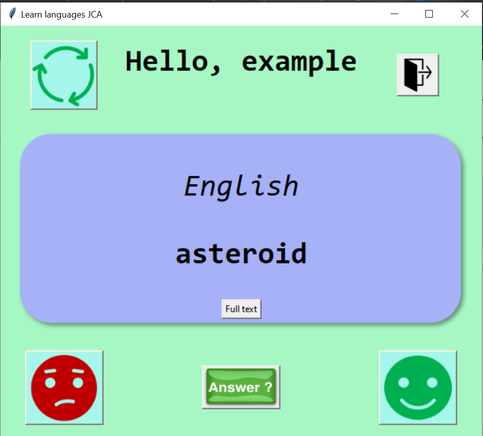

# Password Vault Archive
Here I hold the old/archived versions of the program.  
This is useful to show how it changed.

## Example of output in V1 & V2
Log in page:  

Main page:  

Word to guess:

Answer:

## Author and Licence
**[Juan Carcedo](https://github.com/JuanCarcedo)**  
2022 Copyright © - Licence [MIT](https://github.com/JuanCarcedo/jca-python-projects/blob/main/LICENSE.txt)
