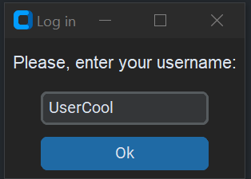
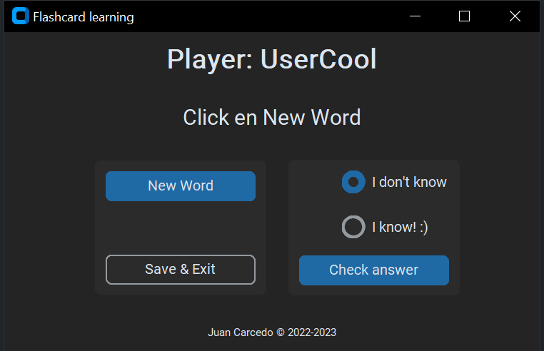
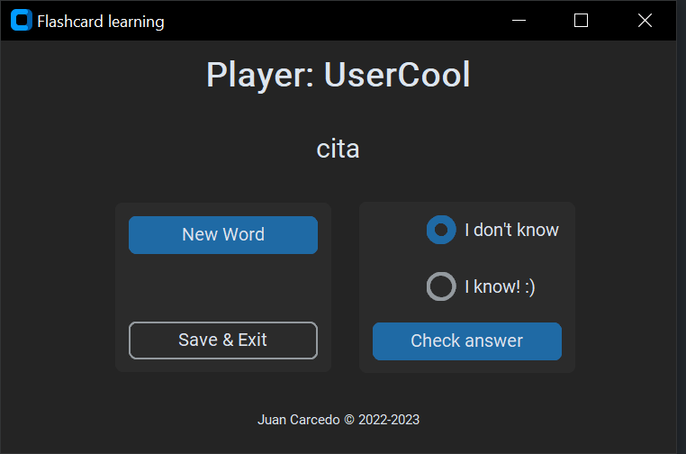

# Flash Cards Spanish-English
This program may help you in your path to learn Spanish.  
Note that your user will be used to save your already-known words and the ones to be learnt.  
  
### Version Updates:  
+ v2 -- 2022/11/01 - General redesign.
+ v3 -- 2023/02/04 - New GUI.
+ v4 -- 2023/06 & 07 - Included setters and getters in the classes.

## Instructions
- Create a Fork of the repository (you can access all projects).
- Open your favourite IDE (I use [PyCharm](https://www.jetbrains.com/pycharm/)).
- Check the ***[requirements.txt](https://github.com/JuanCarcedo/Flash-Cards/blob/main/requirements.txt)*** file.  
  - For this project you will need:
    + tkinter.
    + pandas.
    + [customtkinter](https://github.com/TomSchimansky/CustomTkinter)

### Note: 
All data is saved in CSV files. Feel free to view them in:  
- ```/data/yourUser_es_en.csv``` to check all words.
- ```/data/yourUser_es_en_correct.csv``` to check the ones you did guess right.  

Please do not modify the names of these files.

## How to use
1) Run the file ```main.py```.
2) Log in into the system. If your user does not exist, the program will create it.
3) Click the New Word button to start.
4) Select 
   - "I don't know" if you do not know the answer.
   - "I know" if you know it.
5) Click "Check answer" to show the correct answer.
   - If you marked "I know", the word will be included in your correct answers. 
6) Rinse and repeat.
7) Whenever you want to exit please click "Save & Exit".
   - Your progress will be saved.  

Enjoy!

## Example of output
Log in page:  


Main page:  


Word to guess:


Answer:


## Author and Licence
**[Juan Carcedo](https://github.com/JuanCarcedo)**  
2022 - 2023 Copyright © - Licence [MIT](https://github.com/JuanCarcedo/Flash-Cards/blob/main/LICENSE)
